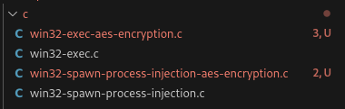
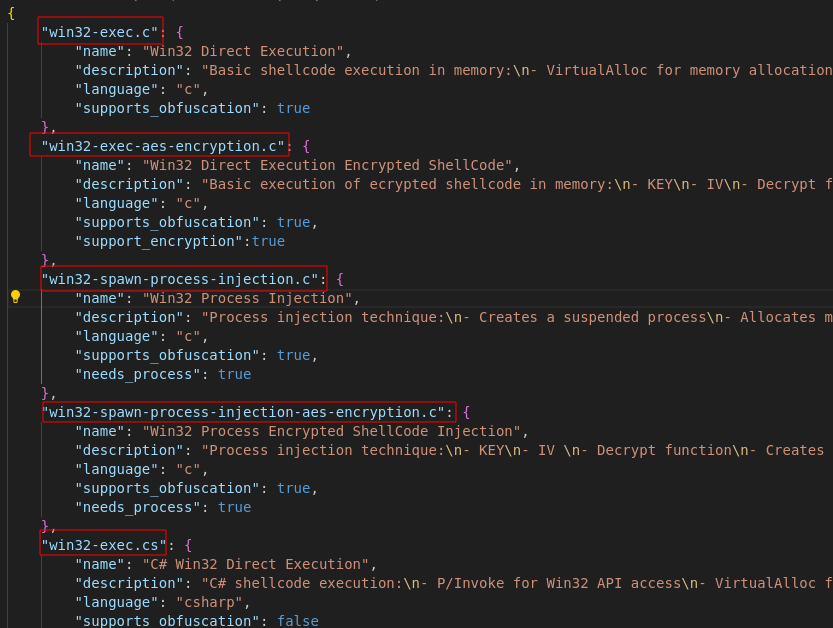

# Templator
ShellCode Template, generate custom shellcode loader trought template selection

  

# Interface

# Template management

## Template Variable 
- position to insert shellcode : `{{shell_code}}`

- position to insert process name : `{{process_name}}`

- position to insert process path : `{{process_path}}`

- position to insert encryption key : `{{key}}`

- position to insert encryption iv: `{{iv}}`

- position to insert encrypted shellcode : `{{encrypted_shellcode}}`

## Template referencement 
You need to give a template that correspond exactly to the of the template.json name

## metadata of template
        "supports_obfuscation": true / false
        "support_encryption":true / false
        "needs_process": true / false
        "needs_process_path": true / false
