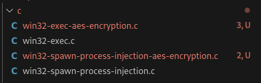
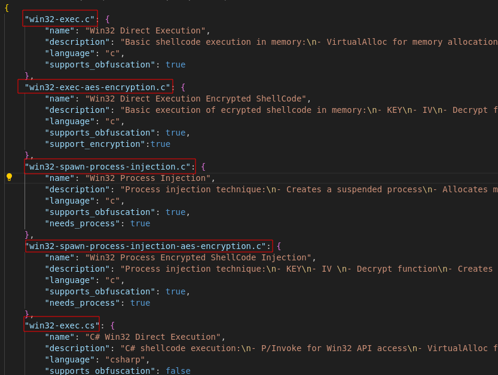

# Templator

ShellCode Template, generate custom shellcode loader trought template selection

  

This program is initially designed to store my/your custom loaders and make them easier to modify so you can quickly inject the shellcode of your preferred C2.

In a second phase, the goal is to allow you to generate a custom loader from scratch by simply referencing placeholders, using the selected programming language and API level.

For now, only Windows is targeted. As a result, there is no native distinction between Linux and Windows when referencing templates.

# Demo
https://github.com/user-attachments/assets/0567df44-3fd0-4798-a233-fa9cd0b48ba8

# Interface

# Template management

## Template Variable 
- position to insert shellcode : `{{shell_code}}`

- position to insert process name : `{{process_name}}`

- position to insert process path : `{{process_path}}`

- position to insert encryption key : `{{key}}`

- position to insert encryption iv: `{{iv}}`

- position to insert encrypted shellcode : `{{encrypted_shellcode}}`

## Template referencement 
You need to give a template that correspond exactly to the of the template.json name

## metadata of template
        "supports_obfuscation": true / false
        "support_encryption":true / false
        "needs_process": true / false
        "needs_process_path": true / false

 
## Features v0.6.5
- [ ] Add New template ( cpp - native - spawn process injection)
- [ ] Add more language to compile
- [ ] Update Installation script to add more language
- [ ] Add basic example of other language
- [ ] Add table to resume which language will be able to compile using installation tools

## Features v0.7
### Generator function :
- [ ] Add référence library :
    ==> Native.h
    ==> Win32.h
- [ ] New web page dedicated to template génération
- [ ] Select langage
- [ ] Select api level
- [ ] Visualize in interconnected map the possible systemcall : pre-phrase --> possibility step by step (1 OpenProcress, Exec, Download) --> find a way to map the possibility
- [ ] Can save the actual template
- [ ] Can debbug (try too compile) actual template
- [ ] Expérimenten full place holder template génération {{win32.openprocress, native.ntopenprocess}}
- [ ] Add New place holder {{langage.c}} in function of language
- [ ] Increase choice methode for encryption template
